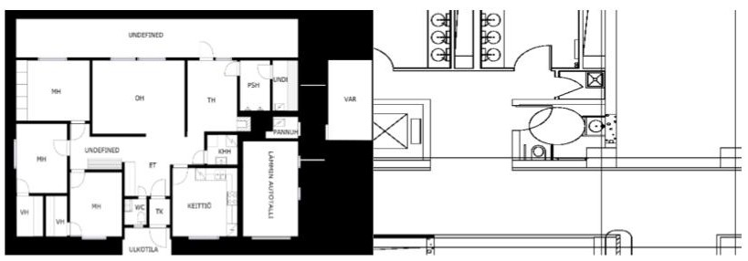
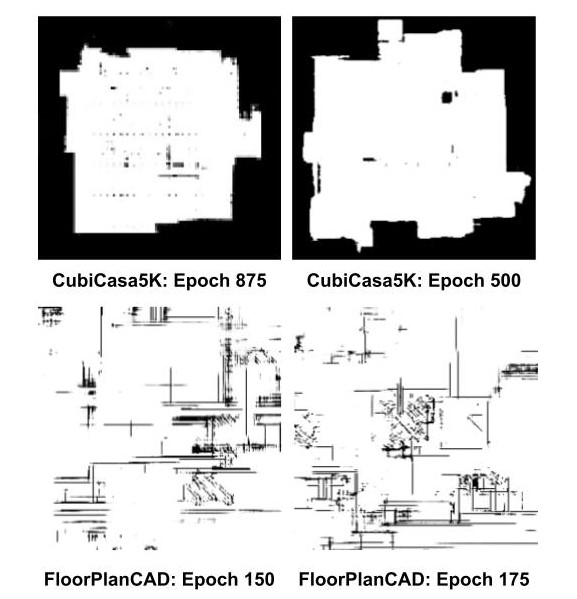
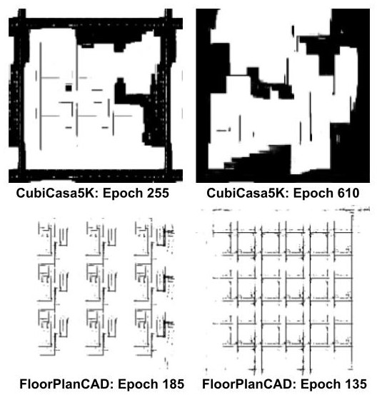

# floor_plan_GAN
## Data
The CubiCasa5k dataset can be downloaded [here](https://zenodo.org/records/2613548). Place the downloaded dataset in the data directory (create if missing). To prepare the svgs for use in training, run `get_cubicasa_svgs.sh` to consolodate all svgs. Similarly, run `get_cubicasa_pngs.sh` to consolodate the rasterized floorplans.

The FloorplanCad dataset can be downloaded [here](https://floorplancad.github.io) and consists of two training datasets and a testing dataset. Place the downloaded datasets in the data directory (create if missing). To prepare the svgs for use in training, run `get_floorplan_svgs.sh` to consolodate all svgs. Similarly, run `get_floorplan_pngs.sh` to consolodate the rasterized floorplans.

Move `tokenizer_data/` into the data directory to be `data/tokenizer_data/`. This will help you avoid having to rerun the tokenizer when training the SVG GAN, which can take a long time (> 1 hour per dataset).

The dataset names and paths have been hardcoded in the training files, so when running a training program, make sure to double check paths.
### Images
An example of the data we are training on is shown before (CubiCasa5k left, FloorplanCAD right).

Below are some examples of our generated images using various architectures.

**Deep Convolutional GAN**

**Self-Attention GAN**

### Text data
`preprocess.py` filters text elements which are not relevant for generation. This is done to simplify the problem for the model. Once this is complete, the `tokenizer.py` has dataset implementation which tokenizes the string. Our tokenization scheme splits the svg into tags and attributes. The values which are not explicitly categorical are tokenized at the character level. For example, fonts have discrete values like 'Helvetica' which will be treated as its own token, but other things like numbers will be split at the character level. Opening and closing tags are also treated as their own tokens. This scheme allows each token to be highly disctinct and meaningful, as well as incorporate knowledge about xml format to smplify the challenge for the model.
## Train files
There are versions to train the GANs on the original FloorPlanCAD dataset as well as binarized versions of the dataset. There are also seperate train files to train with Wasserstein (WGAN) loss (`train_wgan_div.py`) as well as WGAN with gradient penalty (`train_wgan_gp_binary.py`). Training for svg generation is also a seperate train file (`train_svg_gan.py`).
## Baseline models
The VAE models are found in `hw2_vae/starter_code/codebase/models/nns/v1.py` and can be run with `hw2_vae/starter_code/run_vae.py`. DCGAN and SA-GAN can be found as `Generator` and `Generator2` in `GAN_model.py` respectively. To run the models in various train configurations using the different training files, they must be imported and used in each file as desired (`train_svg_gan.py`, `train_gan_binary.py`).
## SVG GAN
The string generation model is in `SVG_GAN.py`. This can only be run with `train_svg_gan.py` as the data format is not compatible with the other train files.
